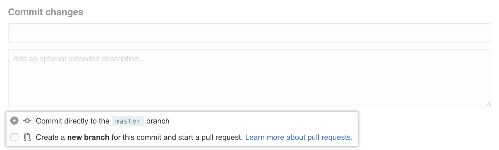
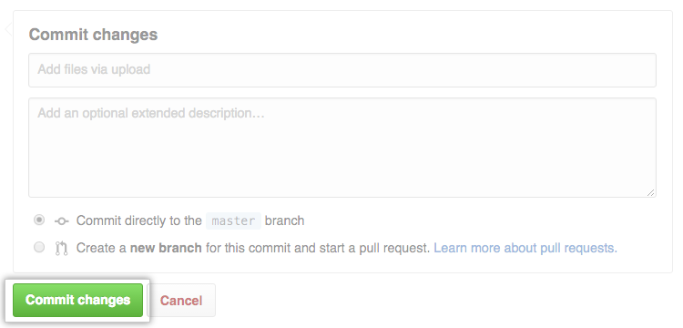

__1.__ En GitHub, vaya a la página principal del repositorio.
## 

__2.__ Debajo de su nombre de repositorio, haga clic en **Cargar archivos**.


## 

__3.__ Arrastre y suelte el área Arrastre y suelte el archivo o la carpeta que desea cargar en su repositorio en el árbol de archivos.


## 

__4.__ En la parte inferior de la página, escriba un breve y significativo mensaje de confirmación que describa el cambio que realizó en el archivo.



:memo: Si el archivo tiene coautoría con alguna otra persona puede atribuir el commit a más de un autor en el mensaje de confirmación, mencionándola, es decir, adicionando a la descripción del commit, el nombre de usuario y correo electrónico del coautor asi: ```Co-authored-by: name <name@example.com>```

## 

__5.__ Opciones de confirmación de la rama Debajo de los campos del mensaje de confirmación, decida si desea agregar su confirmación a la rama actual oa una nueva. Si su rama actual es master , debe elegir crear una nueva rama para su confirmación y luego crear una solicitud de extracción .


## 

__6.__ Confirmar botón de cambios Haga clic en Confirmar cambios.


## 
