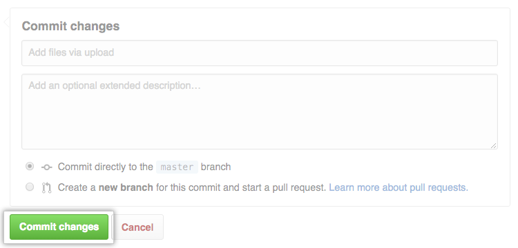

__1.__ En GitHub, vaya a la página principal del repositorio de su proyecto.
## 

__2.__ En su repositorio, busque la carpeta donde desea crear un archivo.
## 

__3.__ El botón Nuevo archivo Encima de la lista de archivos, haga clic en **Crear nuevo archivo**.

## 

__4.__ En el campo de nombre de archivo, escriba el nombre y la extensión del archivo. Para crear subdirectorios, escriba el / separador de directorio.

## 

**5.** En la pestaña **Editar archivo nuevo**, agregue contenido al archivo.

## 

__6.__ Para revisar el contenido nuevo, haga clic en **Vista previa**.

## 

__7.__ En la parte inferior de la página, escriba un breve y significativo mensaje que describa el cambio que realizó en el archivo. Puede atribuir el compromiso a más de un autor en el mensaje de confirmación.

## 

__8.__ Debajo de los campos del mensaje de confirmación, decida si desea agregar su confirmación a la rama actual oa una nueva. Si su rama actual es master, debe elegir crear una nueva rama para su confirmación y luego crear una solicitud de extracción .

## 

__9.__ Haga clic en **Proponer nuevo archivo**.

## 
