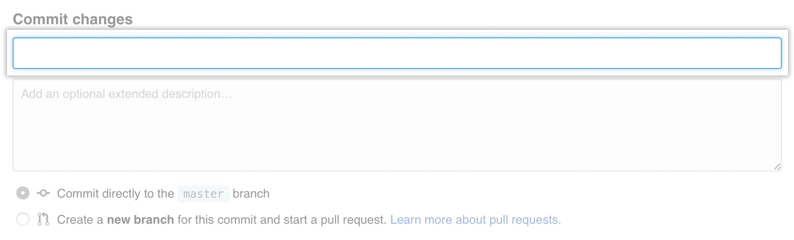

__1.__ En GitHub, vaya a la página principal del repositorio de su proyecto.
## 

__2.__ En su repositorio, busque la carpeta donde desea crear un archivo.
## 

__3.__ Encima de la lista de archivos, haga clic en **Create new file** ó **Crear nuevo archivo** según aparezca en tu navegador.
## 

__4.__ En el campo de nombre de archivo, escriba el nombre y la extensión del archivo. Para crear subdirectorios, escriba el / separador de directorio.


## 

**5.** En la pestaña **Editar archivo nuevo**, agregue contenido al archivo.

## 

__6.__ Para revisar el contenido nuevo, haga clic en **Vista previa**.


## 

__7.__ En la parte inferior de la página, escriba un breve y significativo mensaje que describa el cambio que realizó en el archivo.

:memo: Si el archivo tiene coautoría con alguna otra persona puedes mencionarla adicionando a la descripción del commit, el nombre de usuario y correo electrónico del coautor asi: ```Co-authored-by: name <name@example.com>```
## 

__8.__ Debajo de los campos del mensaje de confirmación, decida si desea agregar su confirmación a la rama actual oa una nueva. Si su rama actual es master, debe elegir crear una nueva rama para su confirmación y luego crear una solicitud de extracción .


## 

__9.__ Haga clic en **Commit changes** ó **Proponer nuevo archivo** según aparezca en tu navegador.


## 
