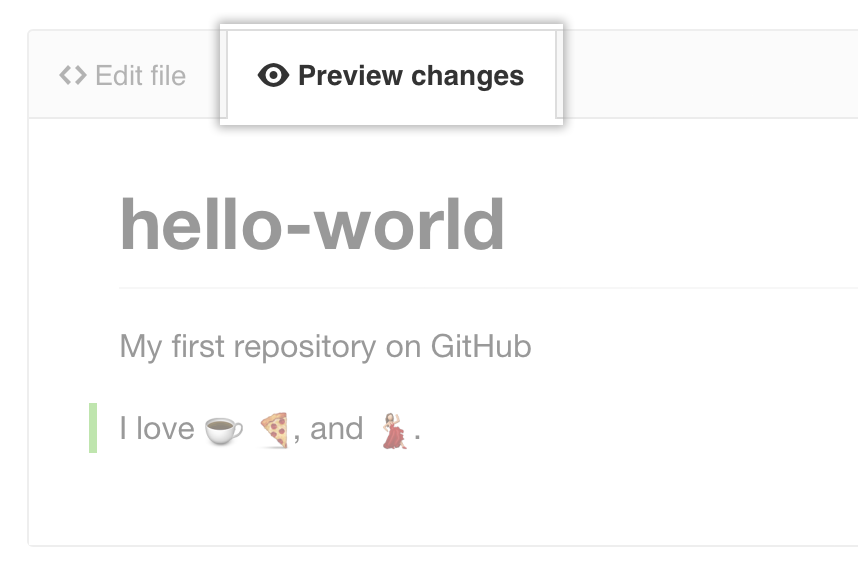

__1.__ En su repositorio, busque el archivo que desea editar.
## 

__2.__ En la esquina superior derecha de la vista de archivo, haga clic en el lápiz para abrir el editor de archivos

## 

__3.__ En la pestaña Editar archivo , realice los cambios que necesite en el archivo.

## 

__4.__ Sobre el nuevo contenido, haga clic en Vista previa de cambios.

## 

__5.__ En la parte inferior de la página, escriba un breve y significativo mensaje de confirmación que describa el cambio que realizó en el archivo. Puede atribuir el compromiso a más de un autor en el mensaje de confirmación.

:memo: Si el archivo tiene coautoría con alguna otra persona puedes mencionar eso adicionando a la descripción del commit, el nombre de usuario y correo electrónico del coautor asi:```Co-authored-by: name <name@example.com>```
## 

__6.__ Debajo de los campos del mensaje de confirmación, decida si desea agregar su confirmación a la rama actual ó a una nueva. Si su rama actual es master, debe elegir crear una nueva rama para su confirmación y luego crear una solicitud de extracción.

## 

__7.__ Haga clic en **Proponer cambio de archivo**.

## 
